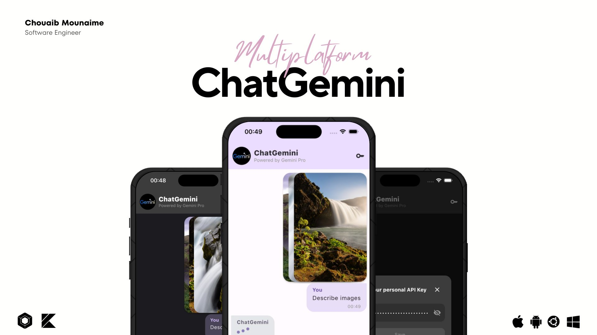

<p> 
  
</p>

<a href="https://getstream.io?utm_source=Github&utm_medium=Github_Repo_Content_Ad&utm_content=Developer&utm_campaign=Github_Android_Video_SDK&utm_term=DevRelOss">

</a>

## 💡 Description

A multiplatform chatbot app (Android, iOS and Desktop) built with Compose Multiplatform and powered by [Gemini Pro API](https://ai.google.dev/docs).

## 📱 Supported platforms
this project supports the following platforms:
* Android
* iOS
* Desktop (Linux, macOS, Windows)

Browser support is not available yet. It will be added in the future.
Note: the project is still in development and not all features are available on all platforms.

## ✨ Features
this project integrates the following features:
* Generate text from text-only input
* Generate text from text-and-image input (multimodal)
* Support for multiple languages
* Support dark and light modes
* Support markdown formatting
* Set your personal API key

## ⚙️ Before you Start

Before you run the project, you need to get an API key from https://ai.google.dev in order to communicate with the Gemini API.
Once the key is obtained, assign it the the constant `API_KEY` in the `GeminiService.kt` file:

```kotlin
private var apiKey: String = "YOUR_API_KEY"
```

or you can set it from the app settings screen.

## 🤝 Contribution

Most of the features are not completed except the chat feature, so anyone can contribute and improve this project.

## 💙 Find this repository useful? 
Support it by staring and sharing it :star:

# License
```xml
Licensed under the Apache License, Version 2.0 (the "License");
you may not use this file except in compliance with the License.
You may obtain a copy of the License at

   http://www.apache.org/licenses/LICENSE-2.0

Unless required by applicable law or agreed to in writing, software
distributed under the License is distributed on an "AS IS" BASIS,
WITHOUT WARRANTIES OR CONDITIONS OF ANY KIND, either express or implied.
See the License for the specific language governing permissions and
limitations under the License.
```

